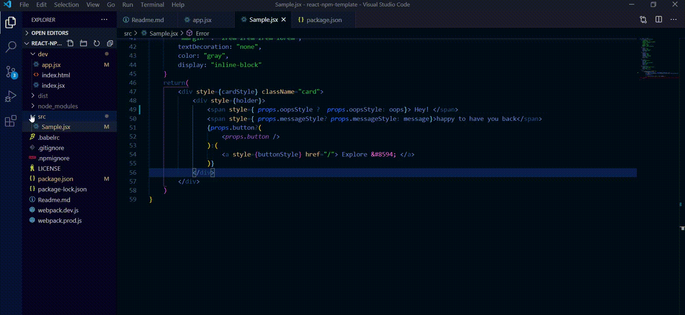
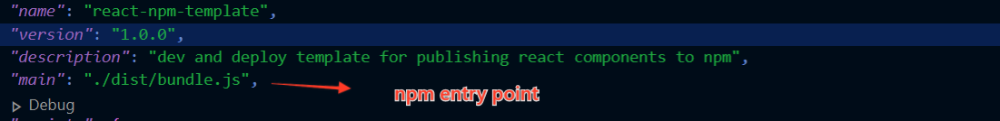
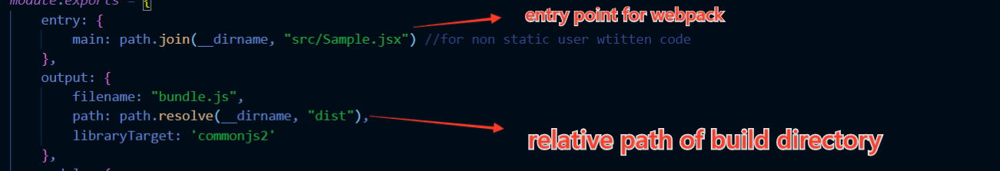
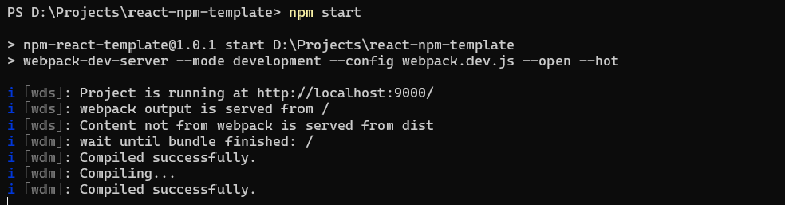
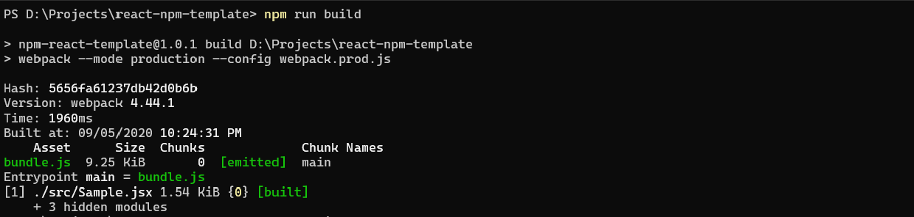
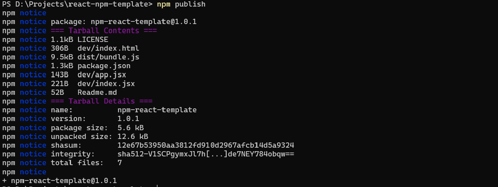

react-npm-template
==================

This repository provides a continuous development and deployment setup for publishing react components to [npm](https://www.npmjs.com/). You can wrtie, test and debug your react components and conveniently publish them to [npm](https://www.npmjs.com/) with a few commands.




### Setup:

This project uses the [webpack](https://webpack.js.org/) dev server to compile and serve the resrouces in dev mode. Both dev and build commands use a common src folder to serve or compile the react components.

Follow these steps to cusomize the repo for yourself:

#### package.json

Navigate to package.json and change the 

* name
* description
* github repository 

of the project. The "main" attribute is where npm will check for the compiled bundle of the react component. Feel free to change the name of the bundle.
> you must change the bundle name in webpack.prod.js if you choos to change the bundle name



Make sure to update values like:
* homepage url 
* keywords


#### webpack

There are two webpack files namely **webpack.dev.js** and **webpack.prod.js**. You don't necessarily need to make any changes to these files, however, If you wish to change the build path for you components, you can update

* output filename
* path 
* entry points 

in **webpack.prod.js**. Make sure the entry point is valid for webpack to be able to build the project.



Commands 
--------

#### Dev Server

```js
npm start
````
opens up the dev server with port 9000. You can place all of your components in src and import them to dev, the dev server hot-reloads with every change.




#### Build

```js
npm run build
```
create an optimal bundle for our react componet, which is ready to be shipped



#### Publishing to npm

```js
npm login
```
enter you credentials 

```js
npm publish
```



Contribute
----------
Your pull requests (PRs) are welcomed

